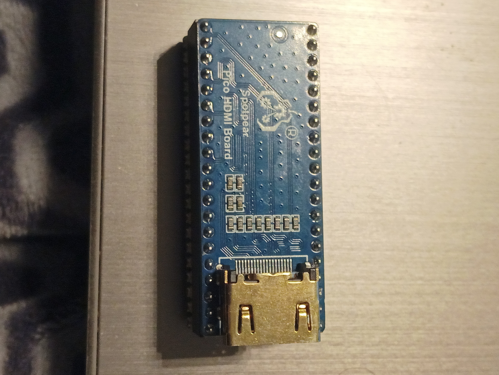
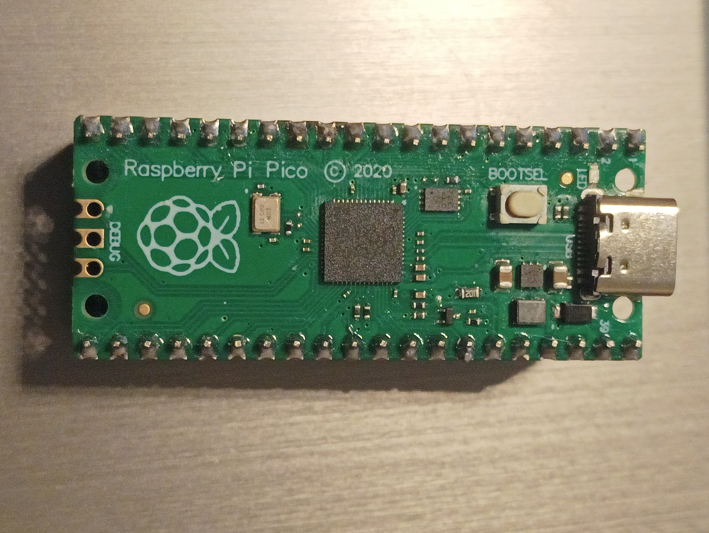
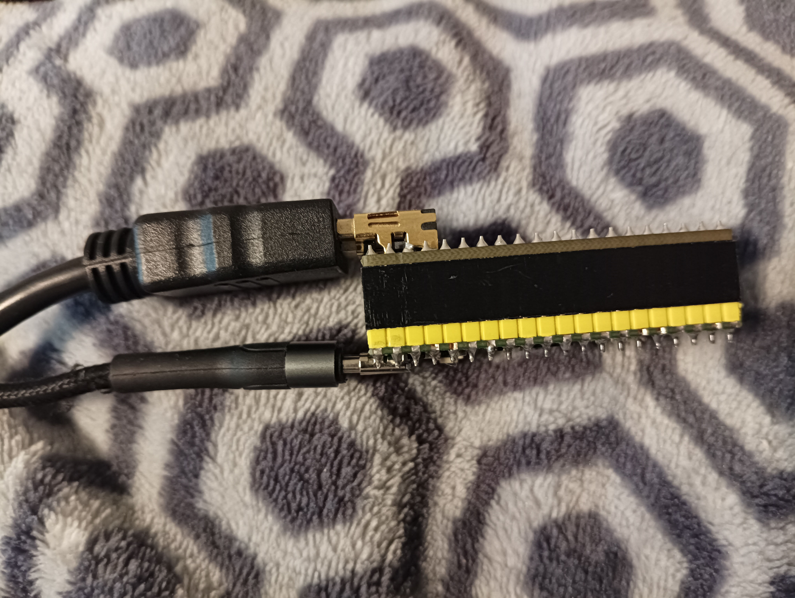

# pico_pi_hdmi_platformer
Small platformer game on raspberry pico pi using Spotpear Hhhhdmi adapter  

Simply install latest Arduino IDE on Linux (reccomended because its faster).  
Then add in preferences Additional Boards Manager URLs:  
https://github.com/earlephilhower/arduino-pico/releases/download/global/package_rp2040_index.json  
Install the Pico Pi board.  
Then Install PicoDVI library to Arduino IDE trough Library manager.  
Connect all wires(USB-C from pico to Computer and HDMI from pico to TV).
Select Right Port of Pico Pi.  

Upload.  

Controls are from buttons in baudrate 115200:  
asdw  
And hit enter after each button pressed to move the player.  
There are TileEditor.html and map_editor.html included. If you need to edit game visually. 
You can run them by simply opening html on your browser.

 

